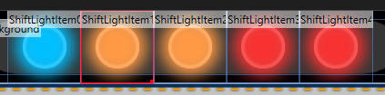

# Shift light component

The shift light component is intended to give a fast way to create a shift light. They will respect the car settings defined in Simhub.

## Specific Properties

### ShiftLightMode

The shift light mode specify when the led will come on :
- ShiftLight1 : when the value is shift light 1 setting is reached
- ShiftLight2 : when the value is shift light 2 setting is reached
- RedLineReached : when the value of the redline is reached

### LedNumber 

Define the "index" of the led, when using `ShiftLight1` or `ShiftLight2` modes. 
This allows to create multiple leds bar progressively powering on.

### TotalLeds

Define the total number of leds, when using `ShiftLight1` or `ShiftLight2` modes. 
This allows to create multiple leds bar progressively powering on.

### RedLineBlink

Enable or disable the redline blinking, when enabled the led will blink when the redline is reached

### RedLineBlinkDelay

Specifies the delay for each blink.

### OffImage

Image used when the led is OFF

### OnImage

Image used when the led is ON

### StackImagesWhenOn

When enabled the OFF image won't be hidden and the ON image will be put over it.
when disabled the OFF image will disappear when the led is ON

### Value 

Default status when starting a dash

