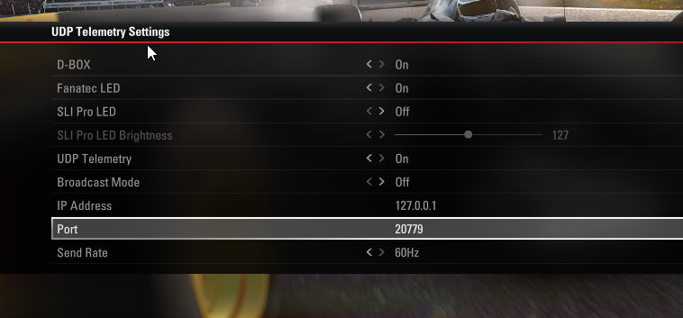
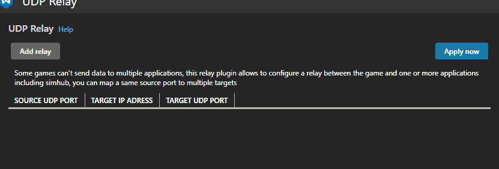
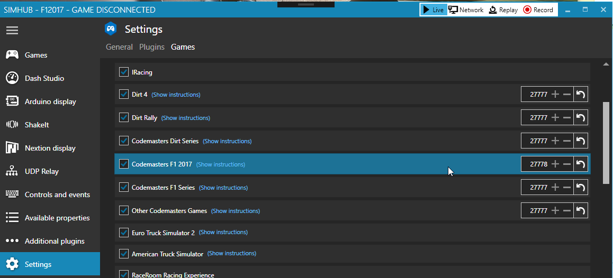

# UDP Plugin

## Introduction

The UDP Plugin allows you to relay UDP data to multiple destinations. 

The relay is compatible with any game using UDP.

## Limitations

Don't configure the same port in UDP relay source port and in the game settings. The UDP relay have to relay the data to SimHub itself.

## Example : Sending F1 2017 data to multiple applications :

#### Configure F12017 to send data to a unused port, IE `20779` :

#### Configure UDP relay to receive data from 20779 and send it to `20777` and `20778` and click `Apply now`,

> Target IP address represents the target device/computer. Use `127.0.0.1` to send the data to the local computer.

#### Configure SimHub to listen to 20778 

#### Configure your motion Rig application to listen to port `20777`.
